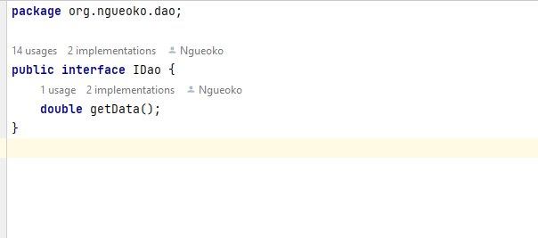
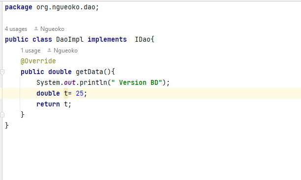
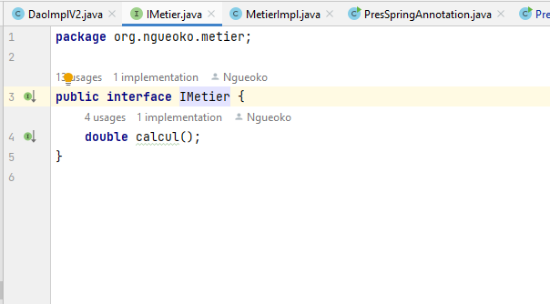
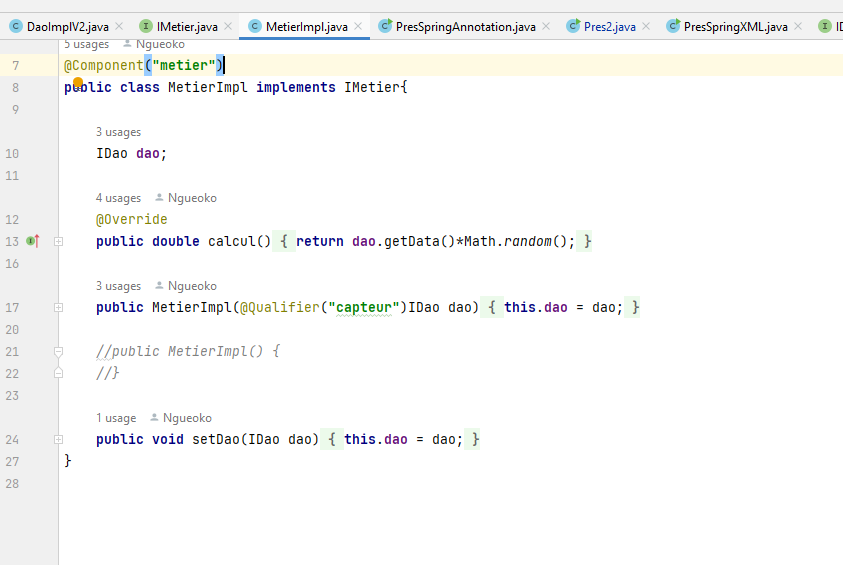
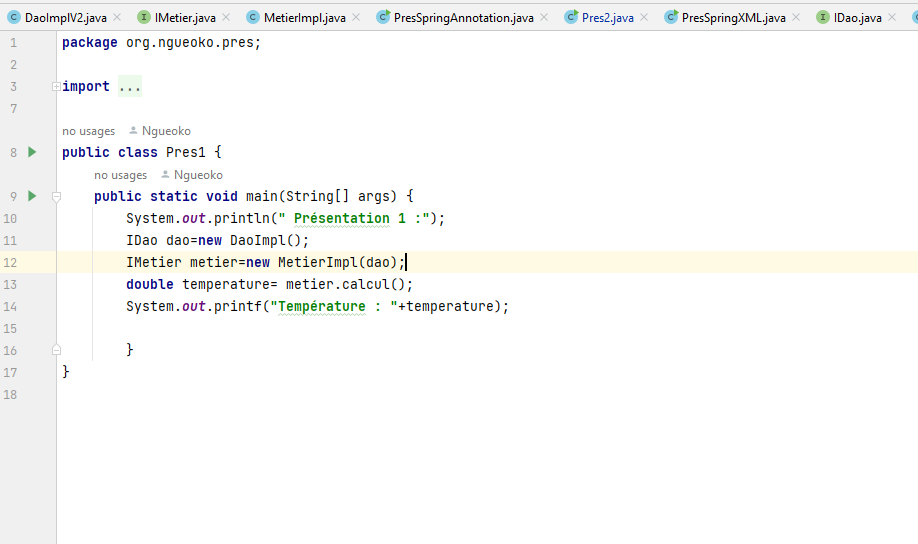
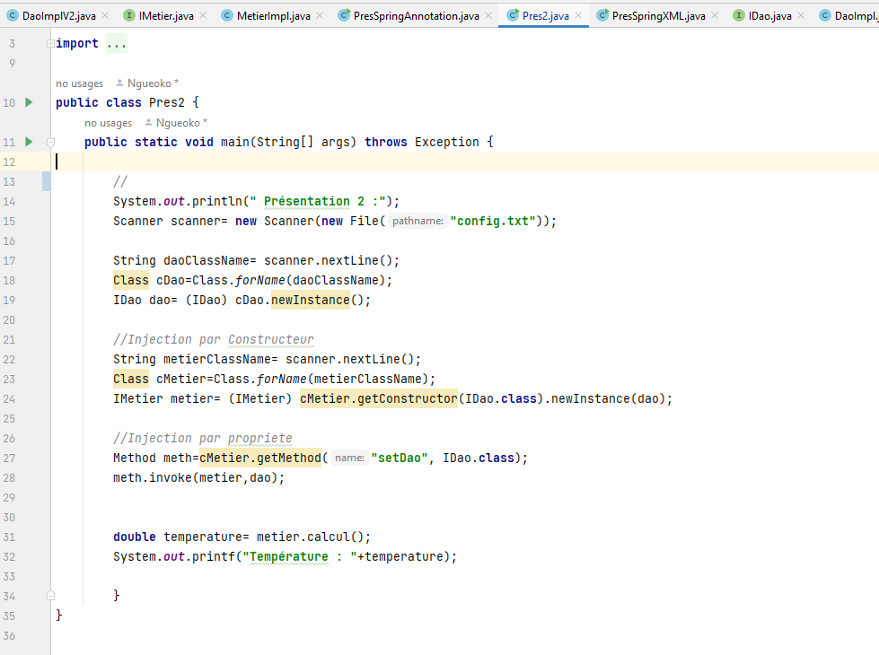
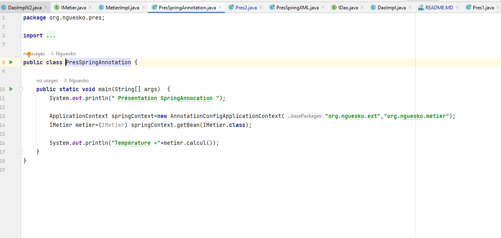
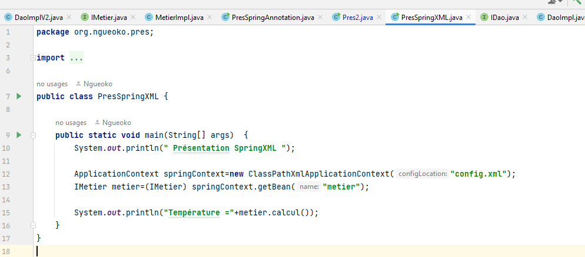

# Inversion de controle IOC
<h1>Cette application utililise implemente plusieurs stratégie pour l'inversion de contrôle</h1>

<h2>Partie 1:  </h2>
<h3>IDao avec une méthode getData</h3>

<h3>IDao Implementation</h3>

<h3>IMetier avec une méthode calcul</h3>

<h3>IMetier implémentation avec couplage faible</h3>

<h3>L'injection des dépendances</h3>
<h4> a. Par instanciation statique</h4>

<h4> b. Par instanciation dynamique</h4>

<h4> c. En utilisant le Framework Spring</h4>

 Annotations

 xml

